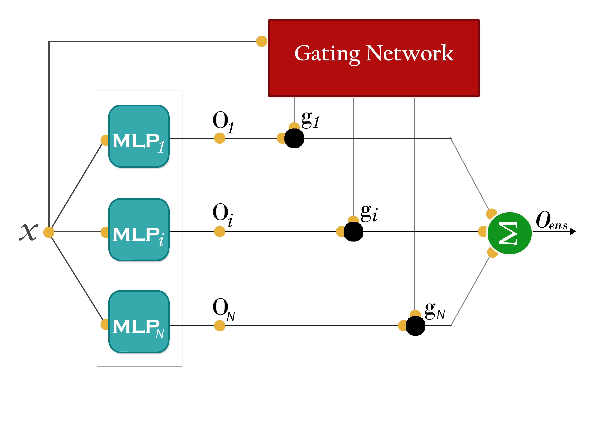

# Mixture Of Experts (MoE)
Mixture of Experts (MoE) is a classical architecture for ensembles where each member is specialised in a given part of the input space or its expertise area. Working in this manner, we aim to specialise the experts on smaller problems, solving the original problem through some type of divide and conquer approach.

### [Reproducing Collabert et al.](https://papers.nips.cc/paper/1949-a-parallel-mixture-of-svms-for-very-large-scale-problems.pdf)

