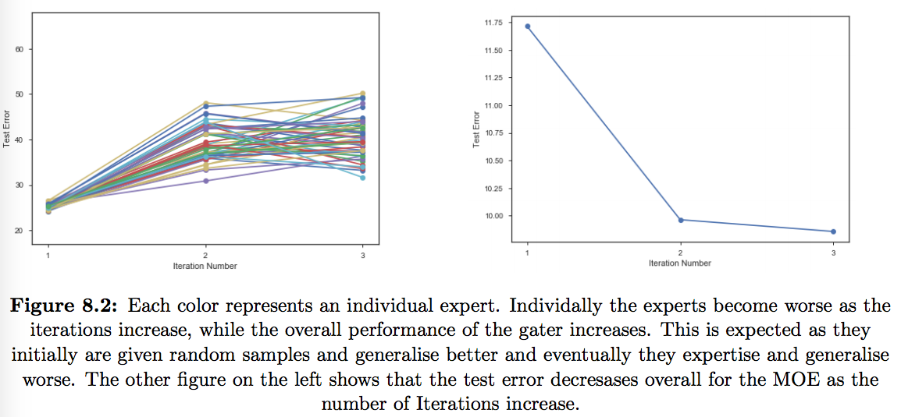
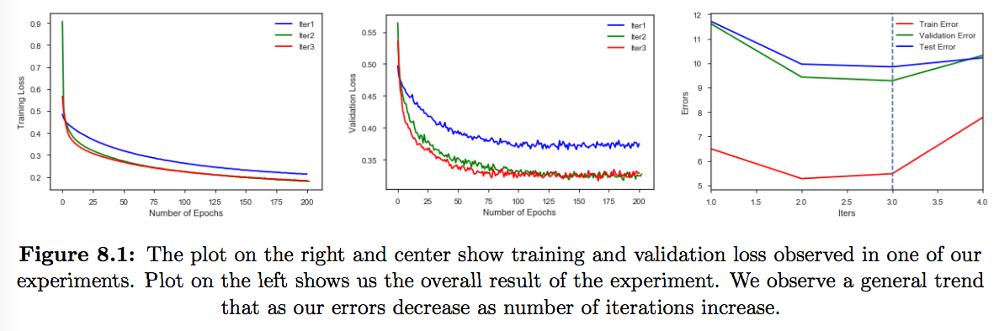

# Mixture Of Experts (MoE)
Mixture of Experts (MoE) is a classical architecture for ensembles where each member is specialised in a given part of the input space or its expertise area. Working in this manner, we aim to specialise the experts on smaller problems, solving the original problem through some type of divide and conquer approach.

My master thesis report can be found [here](https://github.com/krishnakalyan3/MixtureOfExperts/blob/master/kalyan_thesis.pdf).

### [Reproducing Collabert et al.](https://papers.nips.cc/paper/1949-a-parallel-mixture-of-svms-for-very-large-scale-problems.pdf)
In the paper the author proposes and new approch to scale SVM (almost linear time) as the number of examples increase. SVMs dont scale as the number of examples incerease.

- Benchmark dataset : Forest
- Change to binary classification problem
- Parameter of the kernel is chosen by cross validation
- Cost function mean square error
- Termination Condition : Validation Error goes up or Number of iterations
- [Configuration](https://github.com/krishnakalyan3/Scripts/blob/master/Thesis/logs/forest.txt)
- [Notebook](https://github.com/krishnakalyan3/Scripts/blob/master/Thesis/notebooks/Forest.ipynb)
- [Code](https://github.com/krishnakalyan3/MixtureOfExperts/tree/master/code/forest)
- [Grid Search Results](https://github.com/krishnakalyan3/MixtureOfExperts/tree/master/forest_gs.md)

SNo.| Experiment | Train Error | Test Error | Seq| Par | Comments
--- | --- | --- | --- | --- | --- | ---
1 | One MLP | 11.72 | 14.43 | [13](https://github.com/krishnakalyan3/Scripts/blob/master/Thesis/logs/forest_single_mlp.txt) |  | 
2 | One SVM | 9.85 | 11.50 | [25](https://github.com/krishnakalyan3/Scripts/blob/master/Thesis/logs/forest_single_svm.txt) |  |  
3 | Unifrom SVM | 16.98 | 17.65 | [15](https://github.com/krishnakalyan3/Scripts/blob/master/Thesis/logs/forest_uniform_seq_svm.txt) | [10](https://github.com/krishnakalyan3/Scripts/blob/master/Thesis/logs/forest_uniform_parallel_svm.txt)|  | 
4 | Gater | 4.94 | 9.54| [140](https://github.com/krishnakalyan3/Scripts/blob/master/Thesis/logs/forest_gater_seq_verbose.txt) |[64](https://github.com/krishnakalyan3/Scripts/blob/master/Thesis/logs/forest_gater_par_bias_1.txt) | Seq has verbose info, timing might be longer as it has verbose info
5 | Gater MLP | 17.27 | 17.66 | [137](https://github.com/krishnakalyan3/Scripts/blob/master/Thesis/logs/forest_gater_mlp.txt) | 

